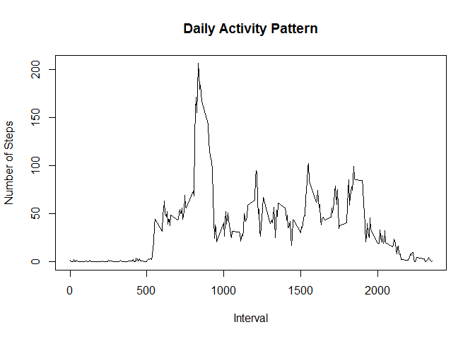

# Reproducible Research: Peer Assessment 1


## Loading and preprocessing the data
To help preprocess the data for later analysis, the following packages will be loaded up:


```r
library(dplyr)
```

```
## Warning: package 'dplyr' was built under R version 3.2.3
```

```
## 
## Attaching package: 'dplyr'
## 
## The following objects are masked from 'package:stats':
## 
##     filter, lag
## 
## The following objects are masked from 'package:base':
## 
##     intersect, setdiff, setequal, union
```

```r
library(tidyr)
```

```
## Warning: package 'tidyr' was built under R version 3.2.3
```

```r
library(ggplot2)
```

```
## Warning: package 'ggplot2' was built under R version 3.2.2
```

```r
library(knitr)
```

```
## Warning: package 'knitr' was built under R version 3.2.2
```

Reading in the data:

```r
setwd("D:/Classes/Data Science Track (Johns Hopkins)/05 Reproducible Research/Week 2/Peer Assesment 1/RepData_PeerAssessment1")
dat <- read.csv("activity.csv")
dat <- tbl_df(dat)
```

Preprocessing the data to remove the >2,000 observations with NA for steps

```r
datClean <- filter(dat, !is.na(steps))
```

## What is mean total number of steps taken per day?
  
Steps taken by day:

```r
steps <-
    datClean %>%
        select(steps:date) %>%
        group_by(date) %>%
        summarize(sum(steps))
        
print.data.frame(steps)
```

```
##          date sum(steps)
## 1  2012-10-02        126
## 2  2012-10-03      11352
## 3  2012-10-04      12116
## 4  2012-10-05      13294
## 5  2012-10-06      15420
## 6  2012-10-07      11015
## 7  2012-10-09      12811
## 8  2012-10-10       9900
## 9  2012-10-11      10304
## 10 2012-10-12      17382
## 11 2012-10-13      12426
## 12 2012-10-14      15098
## 13 2012-10-15      10139
## 14 2012-10-16      15084
## 15 2012-10-17      13452
## 16 2012-10-18      10056
## 17 2012-10-19      11829
## 18 2012-10-20      10395
## 19 2012-10-21       8821
## 20 2012-10-22      13460
## 21 2012-10-23       8918
## 22 2012-10-24       8355
## 23 2012-10-25       2492
## 24 2012-10-26       6778
## 25 2012-10-27      10119
## 26 2012-10-28      11458
## 27 2012-10-29       5018
## 28 2012-10-30       9819
## 29 2012-10-31      15414
## 30 2012-11-02      10600
## 31 2012-11-03      10571
## 32 2012-11-05      10439
## 33 2012-11-06       8334
## 34 2012-11-07      12883
## 35 2012-11-08       3219
## 36 2012-11-11      12608
## 37 2012-11-12      10765
## 38 2012-11-13       7336
## 39 2012-11-15         41
## 40 2012-11-16       5441
## 41 2012-11-17      14339
## 42 2012-11-18      15110
## 43 2012-11-19       8841
## 44 2012-11-20       4472
## 45 2012-11-21      12787
## 46 2012-11-22      20427
## 47 2012-11-23      21194
## 48 2012-11-24      14478
## 49 2012-11-25      11834
## 50 2012-11-26      11162
## 51 2012-11-27      13646
## 52 2012-11-28      10183
## 53 2012-11-29       7047
```

Histogram showing the distribution and frequency of the total steps taken each day:

```r
qplot(steps$`sum(steps)`,
      data = steps,
      binwidth = 2500,
      xlab = "Total Steps",
      ylab = "Frequency",
      main = "Total Steps Taken Each Day")
```

 

The mean and median of the total number of steps taken per day:

```r
stepsSum <-
    steps %>%
        summarize(mean(steps$`sum(steps)`), median(steps$`sum(steps)`))

stepSumRename <- data.frame(stepsSum)
colnames(stepSumRename) <- c("Mean", "Median")
print(stepSumRename)
```

```
##       Mean Median
## 1 10766.19  10765
```


## What is the average daily activity pattern?


```r
byInterval <-
    datClean %>%
    select(-date) %>%
    mutate(interval = factor(interval)) %>%
    group_by(interval) %>%
    summarize(mean = mean(steps)) %>%
    mutate(interval = as.numeric(interval))

plot(byInterval, type="l",
     xlab="Interval",
     ylab="Number of Steps",
     main="Daily Activity Pattern")
```

 

Which 5-minute interval, on average across all the days in the dataset, contains the maximum number of steps?

```r
byInterval %>%
    filter(mean == max(mean)) %>%
    print
```

```
## Source: local data frame [1 x 2]
## 
##   interval     mean
##      (dbl)    (dbl)
## 1      104 206.1698
```

## Imputing missing values


## Are there differences in activity patterns between weekdays and weekends?
